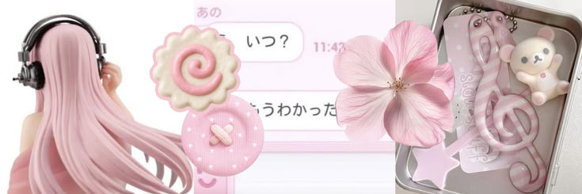

  <!-- 1. BANNER UTAMA -->
  

<h1 align="center">Hello, I'm DianAgustine ⋆.ೃ࿔*:･ </h1>

  Chasing bugs, building projects, and making code aesthetic ✨ 
  On a journey to level up my skills in the tech world. Let's connect! 🌱🚀

---

<h3 align="center">Connect with Me ✨</h3>

  

---

<h3 align="center">GitHub Stats ><</h3>

  
  

---

<h3 align="center">Contribution Graph ><</h3>

  

